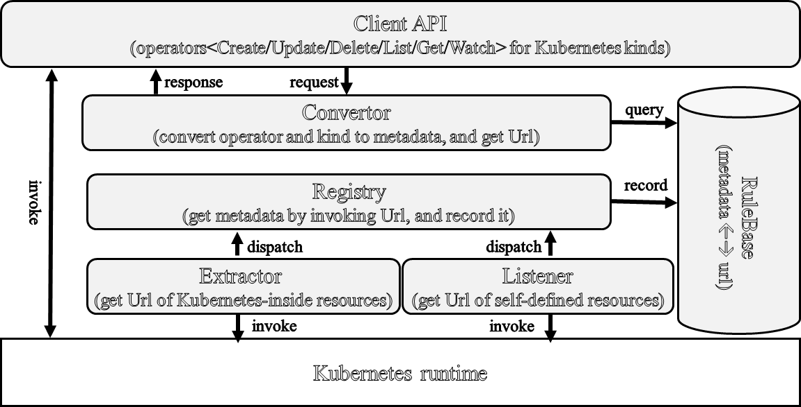

# client-c++

We expect to provide a C++ client:

- **Flexibility**. It can support all Kubernetes-based systems with minimized extra development, such
  as [Openshift](https://www.redhat.com/en/technologies/cloud-computing/openshift), [istio](https://istio.io/), etc.
- **Usability**. Developers just need to learn to write json/yaml(kubernetes native style)
  from [Kubernetes documentation](https://kubernetes.io/docs/home/).
- **Integration**. It can work with the other Kubernetes clients, such
  as  [official](https://github.com/kubernetes-client/go).

This project is based on the following softwares. 

| NAME  |   Website                       | LICENSE         | 
|-------|---------------------------------|-----------------|
| curl |  https://github.com/curl/curl | MIT  |
| nlohmann |  https://github.com/nlohmann/json | MIT  |
| base64 |  https://github.com/tplgy/cppcodec | MIT  |


## Comparison

|                           | [official](https://github.com/kubernetes-client/go) | [cdk8s](https://cdk8s.io/) | [this project](https://github.com/kubesys/kubernetes-client-go)  | 
|---------------------------|------------------|------------------|-------------------|
|        Compatibility                      | for kubernetes-native kinds    | for crd kinds                 |  for both |
|  Support customized Kubernetes resources  |  a lot of development          | a lot of development          |  zero-deployment     |
|    Works with the other SDKs              |  complex                       | complex                       |  simple              |     

## Architecture



## Installation

```shell
git clone  https://github.com/kubesys/client-c
```

### Maven users

## Usage

- [Usage](#usage)
    - [中文文档](https://www.yuque.com/kubesys/kubernetes-client/overview)
    - [Creating a client](#creating-a-client)
    - [Simple example](#simple-example)
    - [Get all kinds](#get-all-kinds)
    - [Work with other SDKs](#work-with-other-sdks)

### Creating a client

There are two ways to create a client:

- By url and token:

```c++
auto client = std::make_shared<KubernetesClient>("https://192.168.203.130:6443",token);
client.Init();
```

Here, the token can be created and get by following commands:

1. create token

```yaml
kubectl create -f https://raw.githubusercontent.com/kubesys/client-go/master/account.yaml
```

2. get token

```kubectl
kubectl -n kube-system describe secret $(kubectl -n kube-system get secret | grep kubernetes-client | awk '{print $1}') | grep "token:" | awk -F":" '{print$2}' | sed 's/ //g'

```

- By filepath:

```c++
// when configpath = "", get default configpath
auto client = std::make_shared<KubernetesClient>("/etc/kubernetes/admin.conf",CONFIGFILE);
client->Init();

// when tokenpath = "", get default tokenpath
auto client = std::make_shared<KubernetesClient>("/var/run/secrets/kubernetes.io/serviceaccount/token",TOKENFIlE);
client->Init();
```

### simple-example
List resources:

```c++
response = client->ListResources("Deployment","");
```

Create a resource:

```c++
response = client->CreateResource(createPod());
```

Get a resource:

```c++
response = client->GetResource("Pod", "default", "busybox3");
```

Delete a resource:

```c++
response = client->DeleteResource("Pod", "default", "busybox2");
```

Watch a resource::
```c++
std::unique_ptr<WatchHandler> w(new PrintWatchHandler());
client->WatchResource("Pod", "default", "busybox",std::make_shared<KubernetesWatcher>(client,std::move(w)));
```


